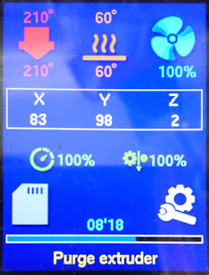
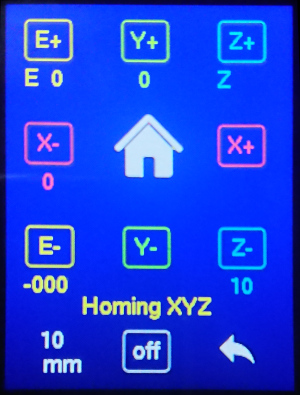

# KP3S
<h1 align="center">Marlin 3D Printer Firmware</h1>

This perository provided as it is and will not be updated. Changes were merged to Marlin <a href="https://github.com/MarlinFirmware/Marlin/">bugfix-2.1.x</a> repository.

Marlin 320x240 LCD portrait mode UI for Kingroon KP3S 3D-printer

    </a>
    </a>

